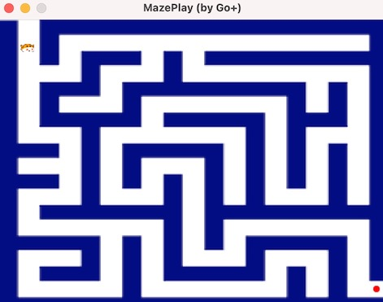

MazePlay - powered by Go+ Builder
=========

### How to run

- Install Go+. See https://github.com/goplus/gop#how-to-install.
- Download this game and run.
  * git clone https://github.com/goplus/MazePlay.git
  * cd MazePlay
  * gop run .
